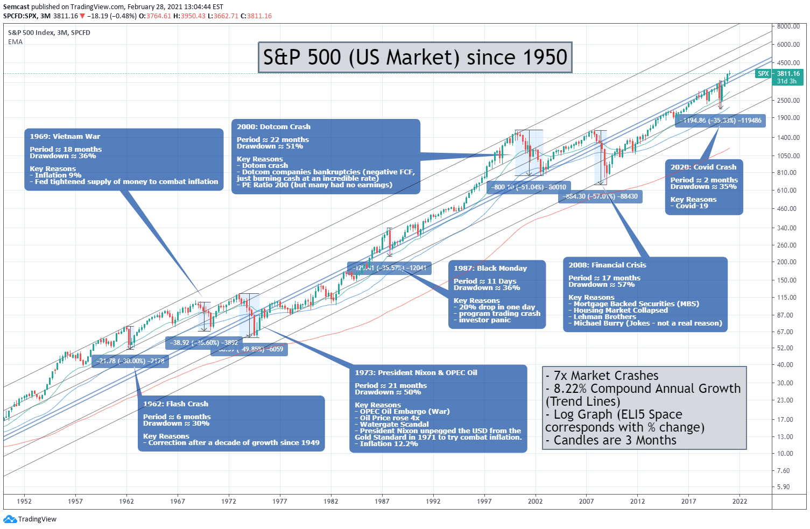

## Market History & Performance
Every investor will eventually hear that *past performance is not a guarantee of future returns*. While this saying is true and should never be taken lightly regarding individual assets, it is not true of the entire stock market over the course of history. Only the God of Israel [knows the future](https://israelmyglory.org/article/modern-israel-in-biblical-prophecy/), but historic stock market performance can be interpreted as relatively reliable and should remove fears about losing everything, or receiving a poor return on investment in the long run.

Reputable markets are shown to be among the safest and most effective ways to build long term monetary growth when basic diversification rules are followed.

History shows that the overall market moves steadily upward regaining even the largest of losses. Part of this relies on a strong underlying economy, which prompts more investors, meaning there is more demand as capital (investment money) enters the market over time, and the other part is due to market's [built-in inflation hedging mechanism](https://www.google.com/search?q=morningstar+why+stocks+are+good+inflation+hedges&source=hp&iflsig=AL9hbdgAAAAAZ2fUho9CIrfV5bhsU5261BPaRS9FBcHi&uact=5&oq=morningstar+why+stocks+are+good+inflation+hedges) when used for long term investing.

When to buy into the market? The temptation to time the market can be avoided by dollar cost averaging<!-- #update_with_instant_preview -->, which is the easiest strategy for maintaining discipline and getting procrastinators to start investing. Set a deposit schedule and investment amount and don't stop investing until retirement. However, as mentioned in [Budgeting](budgeting.md)<!-- #internal_link -->, this amount should increase over time as you earn more to offset inflation, provide a larger cushion of retirement income, and prepare for unexpected costs or the need for or privilege of early retirement.

- Opinion: for those sitting on a pile of cash and looking to invest, it may make sense to at least pay attention to what is going on with the economy, as there may be indicators of a drop or continued drop in market to make the most of a buy-in, e.g., if the economy is *currently* being affected by a largescale war or other global catastrophe. 

[Recessions are inevitable](https://get.ycharts.com/resources/blog/inverted-yield-curve-what-it-means-and-how-to-navigate-it/), and the average annual market drawdown of the US stock market since 1980 has been about 14%. The caveat is that this is the *average*, and timing the market is considered virtually impossible. A drop may only come after years of a rising market and a decline may not drop low enough to reach the price level before the rise started where an investor could have bought-in at a lower price, accumulated overall better returns, and saved themselves the time and energy of watching and wondering. The most eye-opening realization for hesitant investors may be the similarity between [good timing versus bad timing](https://www.schwab.com/learn/story/does-market-timing-work) compared to not investing at all. Here is one more chart on [the downside of missing the best days in the market](https://www.hartfordfunds.com/practice-management/client-conversations/managing-volatility/timing-the-market-is-impossible.html).
### S&P 500 Index 1950-2020
The following graph comes from a Reddit user who wanted to provide reassurance for the inevitable bumps that equities (stock) and debt (bond) investors are going to experience. Click to expand, view notes and see the proportions of the logarithmic graph.

- Log graphs display price intervals as percentages and display relative growth better than linear graphs do over a long period.
- The most common style of market graph uses what are called candles. Candles show the price movement for the period represented by each candle. Green candles are increases in price and red are decreases. The tops and bottoms of the solid part of each candle represent the start and end (opening and closing) prices for the period, in this case 3 months per candle. The lines extending above and below the solid part of the candle are called wicks, which represent the highest and lowest prices reached during the period.
- Understanding the details of reading this chart is not as important as the overall message it gives to long term investors: the market has averaged a steady compound annual growth rate despite the fluctuations and market crashes.

- Full discussion: [S&P 500 since 1950 - graph showing all crashes](https://www.reddit.com/r/investing/comments/lujnvo/sp_500_since_1950_graph_showing_all_crashes/?rdt=61105) (r/investing)
	- To see the present day chart on [TradingView](https://www.tradingview.com/chart/?symbol=SP%3ASPX), set the interval to All and the scale to Logarithmic (default Log 10) in the settings icon on the bottom right of the chart or using the keyboard shortcut Alt+L.
- This is an interesting [introductory discussion on market value](https://www.reddit.com/r/investing/comments/15mqzsv/the_reason_why_the_stock_market_always_is_over/) from Reddit. It is not important to focus on while learning how to invest, but it may answer questions that come to mind about the market.
- [Does the S&P 500 actually average 8-12% return per year???](https://www.reddit.com/r/Bogleheads/comments/1cncyp3/does_the_sp_500_actually_average_812_return_per/) (r/Bogleheads)
- [The SP500 inflation-adjusted annual return is only 4.3% over the past 22 years.](https://www.reddit.com/r/Bogleheads/comments/uztn8x/the_sp500_inflationadjusted_annual_return_is_only/) (r/Bogleheads)
- [If 30-year treasuries were so high in the eighties at over 14% at a point, why didn't everybody just put all of their retirement money in 30 year treasuries?](https://www.reddit.com/r/personalfinance/comments/15s267u/if_30year_treasuries_were_so_high_in_the_eighties/) (r/personalfinance)
- There are many more indexes to invest in other than the US S&P 500, including options to invest in every sub-category of the US market or even the world. These are called total market funds and perform similarly over the long run. The theoretical advantage of a world fund is that some other country's economy should improve when another's declines as long as equal amounts of an investor's capital are allocated to each.
## Investment Examples
The significance of a steady long term rate of return relates to the principle of compounding. Using this [calculator](https://www.nerdwallet.com/calculator/investment-calculator), what is the gross maturity value (an investment's value before taxes and fees at the end of an investment period) of a $1000 investment after 20 years, earning the estimated 8.22% annual return shown in the graph, compounded annually without making any monthly contributions? What about 25 years? Without adding any more money to the account, look what happens to the original investment. That is the advantage of compounding *(while compounding does not occur in the market at a steady rate from year to year as it does in a savings account, the increase in value of equities and the reinvested dividend payouts over time act as an interest payment to the investor; dividends are periodic payouts to shareholders as a way to share profits with investors without having to sell shares of stock)*.

- Now what if after the investing $1000, you contribute $100 monthly for the duration of 30 years (a total of $37,000 invested)?
- What about when it is $200 every month (a total of $73,000 invested)?
- Now comparing to high yield savings account interest rates, where a 5.00% annual rate of return is considered high, how would this change the gross maturity value if all of the investment capital was placed into the best savings account instead of invested into the market?
	- Notice that a seemingly small percentage difference makes a big monetary difference when it comes to compounding over a long period of time. The difference becomes even greater as the investment period increases. Without contributing any money to the initial $1000 investment, observe the difference using the two rates (5.00% and 8.22%) at 20, 30, and 40 year periods.
- This is the importance of living according to a budget, beginning investing as early as possible, and having an investing mindset, i.e. being on the lookout for the how to invest in whatever it may be with the highest return on investment (ROI).
## Realistic Expectations
Notice that a steady rate of return was used in the examples, which was the market average over the period shown on the graph. Also know that to receive the highest rate of return, dividends must be reinvested. In real life, an individual investor does not always have time to wait out the crashes in the market which can take years to recover. Therefore, depending on how much an investor is able to accumulate for retirement, owning diversified financial assets and shifting a larger portion of them to lower risk, lower reward assets as an investor gets closer to retirement may be important to maintaining the longevity of a predictable lifestyle.

Still, by taking advantage of the relatively safe, higher rate of return that the stock market offers across decades of time, and slowly tapering this rate of return through less risky interest earning assets, investors can end up with a satisfying return on investment.

Next, to earn and keep the most money to use during retirement, taxes and investing expenses need to be kept to a minimum.
